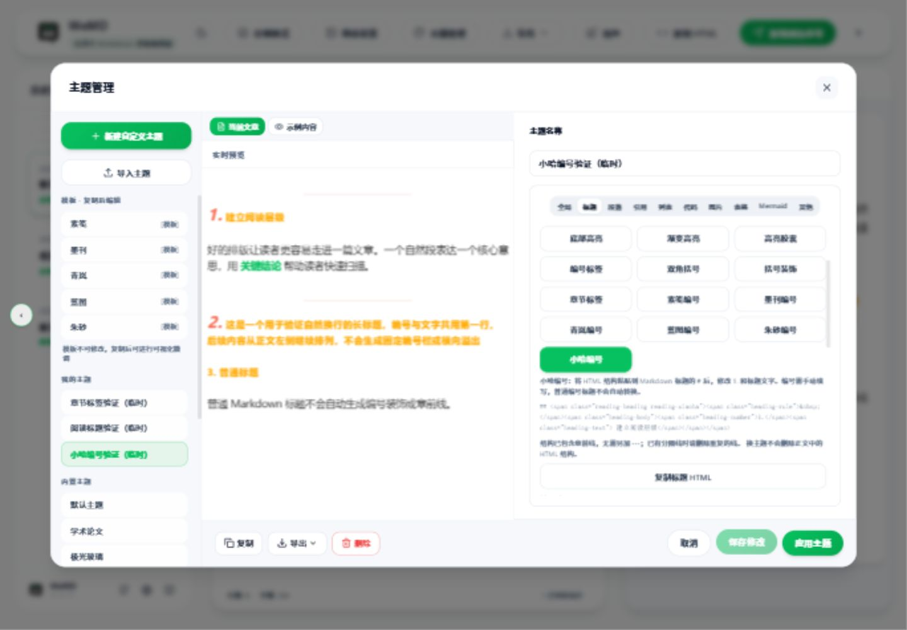

# Verification: Xiaoha heading

Verified on 2026-10-01 in `codex/reading-heading-html`.

## Reference and delivered behavior

Reference checkout: `D:/Work/sync_remote_projtcts/temp/WeDraft`.
`templates/default-business.json` defines heading and divider defaults;
`packages/wechat-renderer/src/index.ts`, `renderHeading2`, defines number/title spans.

The visual designer now exposes 小哈编号 (`reading-xiaoha`). Copy returns the
complete authored HTML fragment, without Markdown heading markers. Guidance
shows the current level's marker and explains manual numbering and the included
divider. Existing number/title controls remain editable. Inline layout uses
编号右间距 instead of vertical spacing or a fixed number column.

## Automated checks

Nine suites: **162 passed, 1 intentionally skipped** (explicit baseline freeze).

```powershell
pnpm --filter @wemd/web exec vitest run src/__tests__/components/readingHeadingPresets.test.tsx src/__tests__/components/headingStylePresets.test.ts src/__tests__/components/chapterLabelReference.test.tsx src/__tests__/components/themeDesignerEditionSeeds.test.ts src/__tests__/components/themeDesignerHeadingDecor.test.ts src/__tests__/services/designerBaseline.test.ts src/__tests__/services/themeSampleDomCoverage.test.ts src/__tests__/services/wechatCopyNormalizer.test.ts src/__tests__/store/themeStore.test.ts
pnpm --filter @wemd/web exec tsc -b --pretty false
```

Scoped ESLint: 0 errors, 1 pre-existing `react-hooks/exhaustive-deps` warning in
`ThemeLivePreview.tsx` (missing `designerVariables`, now line 241).

Selection/copy tests use actual `HeadingSection`, parser, `renderOffscreenContent`
and `serializeWechatCopyHtml`. Final payload retains the number's 25px, italic,
900 weight, 1.19 line height and coral color; the title's content owner retains
15px and orange. Divider retains 36% width, longhand border and 40px/18px margins.
No unresolved `var(--wemd-*)`, NaN or undefined remains. Emphasis and links
survive. Plain Markdown headings do not get a synthetic number or divider.
H1 accepts the 15px default; an 8px right gap survives final serialization.
Actual theme store export/import preserves edited Xiaoha fields and CSS.

The explicit freeze generated 61 configurations. `git diff` shows only the
manifest modification and new `headingPreset-h2-reading-xiaoha.css`; all prior
60 CSS fixtures stayed byte-identical. Both sample Markdown sources and their
research mirror contain an explicit `1.` heading; coverage verifies the node.

## Real Vite application

Started with `pnpm dev:web`. Through the actual UI:

- Copied a temporary theme, selected H2 小哈编号, saved and applied it.
- Read the browser clipboard and checked the complete snippet, including `1.`
  and its literal inter-span space. Used Ctrl+V to paste it after `##` into a
  newly created test article.
- Inspected main preview and theme-preview iframe: number 25px/italic/#F96E57,
  title 15px/normal/#FFA900. Main divider measured 124.547px over a 346px body
  (36%). This is rendered browser evidence, beyond CSS string inspection.
- A long title wrapped into three fragments at the main preview width, with
  no overflow and 0px padding/text-indent. Later lines start at the body edge.
- Changed 编号右间距 to 8px, saved, reloaded the page and measured 8px in the
  rendered number. Restored the reference 0px gap afterward.
- Reopened the designer and checked the selected option and default title size.
- No browser console errors were captured.



The temporary test theme/article remain available for review. The original
welcome article and its original chapter-label theme were restored; browser
viewport overrides and the agent-started Vite process are cleaned up.

## Limit

Actual paste into the WeChat Official Account editor is still a device/manual
acceptance step. Browser text clipboard and automated final HTML serialization
do not establish what WeChat will retain after saving a draft.
